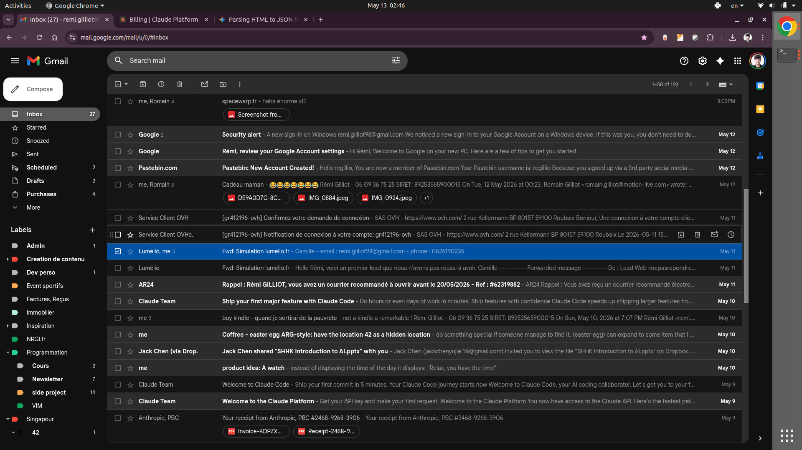

# Camelia

## Overview

Camelia is a mail-based lead follow-up assistant for Lumélio. It turns forwarded lead emails into a routed, bookable follow-up flow: read the message, extract the lead details, assign a sales rep, pick available slots, compose a reply with a booking link, and persist the lead in a JSON database.

The repository is a runnable prototype. It intentionally uses small scripts, flat JSON files, and a tiny PHP dashboard so the whole flow stays easy to inspect during a presentation.

### Problem

Lumélio is a solar installer operating in the Hauts-de-France region. Around four field sales reps cover ~50 km radii out of Dunkerque, Arras, Arleux, and Aire-sur-la-Lys. Leads come in through the public `lumelio.fr` site (forwarded into a shared inbox), but the sales team can't always reach every prospect by phone in time. Unanswered leads then sit cold for hours or days — exactly the window in which they're most likely to go to a competitor.

Camelia closes that gap by automatically reading a forwarded lead, matching it to the right rep based on the city in the address, picking the rep's next free 2-hour slots, and emailing the prospect a one-click booking link in both French and English. The lead's status and the rep's calendar update the moment the prospect clicks.

### Outcome

- A working intake pipeline that can read a lead, assign a rep, pick the next available slots, and generate the reply email.
- A JSON-backed lead store in `data/leads.json` that keeps the current state visible.
- A tiny dashboard in `dashboard.php` that renders the parsed JSON as a browser view.
- A booking endpoint in `vps/book.php` that confirms a slot and marks it busy.
- 4 sales reps are configured, each with a dedicated schedule file.
- Lead state is tracked across the `picked`, `sent`, and `booked` lifecycle in one JSON database.
- The demo can run end-to-end locally without SMTP by using `CAMELIA_DEMO_MODE=1`.

## Demo



1. Start the PHP server in `camelia/`:
   `php -S 127.0.0.1:8000 -t .`
2. Start the mailbox daemon in another terminal:
   `python3 daemon.py`
3. Forward or transfer an email to `lumelio.camelia@gmail.com` with `lumelio.fr`
   in the subject.
4. Wait for the daemon to detect the message, parse it, compose the reply, send
   it, and update `data/leads.json`.
5. Open the dashboard:
   `http://127.0.0.1:8000/dashboard.php`
6. Open the generated booking link from the reply email to confirm the slot.

Demo asset:

- `exports/calendar-screenshot.png`

## Technology Stack

### Frontend components

- Minimal HTML returned by `vps/book.php`.
- Minimal HTML dashboard in `dashboard.php`.
- HTML email bodies generated by `compose.py`.

### Backend components

- Python 3 scripts for parsing leads, matching reps, picking slots, storing state, composing emails, sending mail, and reading Gmail.
- JSON files for rep profiles, city mapping, schedules, lead state, and canonical demo inputs.
- Gmail IMAP and SMTP access in `fetch_leads.py`, `read_inbox.py`, `send.py`, and `send_test_email.py`.
- Bash deployment helpers in `deploy.sh` and `vps/setup_subdomain.sh`.
- PHP booking logic in `vps/book.php`.

## Development Approach with AI

### AI tools

- **Claude Code** (Sonnet 4.6, then Opus 4.7 once usage limits hit) — primary builder. Drove the bulk of the implementation: IMAP/SMTP plumbing, the parse → pick → compose → send pipeline, the booking endpoint, the dashboard, and the VPS deploy scripts.
- **Codex (GPT-5)** — used after Claude usage limits, mostly for refactoring passes, doc rewriting, and dead-code cleanup once the live pipeline stabilized.
- Local shell (Python, `php -S`, `imaplib`/`smtplib` smoke tests) for verification at each step.

### AI agents

- Single primary coding agent per session — Claude or Codex, never both at once.
- No formal sub-agent delegation. When a session's context got too long, I started a fresh one and pointed it at [`INSTRUCTIONS.md`](./INSTRUCTIONS.md) so it could re-anchor on the canonical state.
- Effective division of labour: **Claude built features end-to-end; Codex came in for cleanup and doc passes.**

### Key prompts

The full per-session prompt history lives in [`INSTRUCTIONS.md`](./INSTRUCTIONS.md) — a hand-curated mix of my own framing and LLM-refined wording that I reuse as the starting prompt for new sessions. The prompts that shaped the project most:

- "Read a forwarded lead JSON, extract `adresse`, derive the city, route to a rep using `sales_reps.json` + `city_to_rep.json`."
- "Compose a bilingual (FR+EN) reply with N one-click booking links per slot. No Calendly, no `mailto:` — Option C only."
- "Wire `daemon.py` as the single demo entrypoint: poll Gmail, parse, compose, send, repeat every 20s."
- "Generate a tiny JSON-backed dashboard so I can show the lead database during the live walkthrough."
- "Write the VPS scripts (`deploy.sh`, `vps/setup_subdomain.sh`) so the booking endpoint can move from `php -S` to a real subdomain when I have DNS access."

### Key review points and decisions

- **Mail identity.** Used a dedicated Gmail (`lumelio.camelia@gmail.com`) with a 16-character App Password over SMTP/IMAP, rather than running a self-hosted MTA on the VPS. The local `sendmail` had no relay configured (263 messages stuck in queue with "Connection refused by [127.0.0.1]") and home/VPS IPs get rejected anyway. Lumélio is already on Google Workspace, so deliverability (SPF/DKIM) is free.
- **Booking flow.** Picked Option C (one-click HTTPS link per slot) over plaintext reply, `mailto:`, or Calendly. Each slot in the outbound email is a unique URL like `https://camelia.lumelio.fr/book.php?t=<token>&s=<slot>` that hits a small PHP endpoint, which marks both the lead and the rep slot booked atomically.
- **VPS attempt, then local pivot.** The plan was to host the booking endpoint at `camelia.lumelio.fr` — a subdomain of the existing `prospection.lumelio.fr` VPS. The scripts to do that (`deploy.sh`, `vps/setup_subdomain.sh`) are written and ready to run. They were paused because I don't yet have write access to the `lumelio.fr` DNS zone, so the subdomain can't be pointed at the VPS. Until that's unblocked, the whole demo runs locally via `php -S 127.0.0.1:8000` on the same machine as `daemon.py`. Booking links in `compose.py` still emit the production URL via `BASE_URL`; flip that constant to `http://127.0.0.1:8000/vps/book.php` for a fully-local rehearsal.
- **Calendar state.** Used a fixed JSON snapshot under `data/schedules/<rep>.json` (5 weekdays × 3 canonical slots: 09:00–11:00 / 14:00–16:00 / 16:00–18:00) rather than scraping live availability from `prospection.lumelio.fr`. Reason: reproducible demos, no live-dependency failure mid-show.
- **State store.** One flat `data/leads.json` with a `picked → sent → booked` lifecycle. Inspectable by eye, idempotent on re-runs (keyed on `lead_email`), and trivially resettable before a rehearsal (`python3 demo_reset.py`).
- **Send safety.** `send.py` honours `CAMELIA_DEMO_MODE=1` (no SMTP connection at all, status is updated locally) and `CAMELIA_TEST_MODE=1` (only addresses in an in-script whitelist get through). This is what lets the daemon loop without risk of mailing real prospects during development.
- **Bilingual templates.** Every prospect-facing email and confirmation page renders FR + EN side by side, because Lumélio operates in francophone northern France but Camelia should be usable bilingually from day one.

## Installation

1. **Python 3.11+** — no third-party packages, the pipeline uses only `imaplib`, `smtplib`, `email`, and `json` from the stdlib.
2. **PHP 8** — needed for the dashboard and the booking endpoint. `php -S` is enough; no Apache/nginx required for local runs.
3. **Gmail credentials.** Create `camelia/.env` (already gitignored):
   ```
   GMAIL_USER=lumelio.camelia@gmail.com
   GMAIL_APP_PASSWORD=<16-char Google App Password, spaces stripped>
   ```
   The Camelia Gmail account must have 2-Step Verification enabled before App Passwords appear in its security settings.
4. **VPS access (optional).** `ssh` + `scp` to the target VPS are only needed if/when DNS for `camelia.lumelio.fr` is unblocked and you want to deploy `vps/book.php` for real. The local demo doesn't need it.

## Usage

### Local demo (current default — booking endpoint runs on `php -S`)

In one terminal:
```
cd camelia
php -S 127.0.0.1:8000 -t .
```

In a second terminal:
```
python3 daemon.py
```

Then forward any email that has `lumelio.fr` in the subject to `lumelio.camelia@gmail.com`. The daemon polls Gmail every 20s; within one cycle it:

1. pulls the message via IMAP (`fetch_leads.py`),
2. parses the forwarded body into a lead fixture under `exports/emails/` (`fetch_leads.py` again),
3. derives the city from `client.adresse`, picks a rep via `data/city_to_rep.json`, and selects 5 free slots (`parse_lead.py` + `pick_slots.py`),
4. composes a bilingual `.eml` into `outbox/` (`compose.py`),
5. sends it via Gmail SMTP and flips the lead to `sent` in `data/leads.json` (`send.py`).

Watch state update live at `http://127.0.0.1:8000/dashboard.php`. Clicking a booking link in the email currently 404s on `camelia.lumelio.fr` (DNS not yet pointed) — for a fully-local rehearsal, change `BASE_URL` in `compose.py` to `http://127.0.0.1:8000/vps/book.php` before composing.

### Useful one-shots

- `python3 demo_reset.py` — wipe `data/leads.json` and clear `outbox/` before a rehearsal.
- `python3 fetch_leads.py` — pull forwarded leads once without the daemon loop.
- `python3 read_inbox.py 10` — list the 10 most recent messages in the Camelia inbox.
- `python3 read_inbox.py show 3` — print the full body of the 3rd recent message (useful for debugging the forward parser).
- `python3 send_test_email.py` — send a hello-world via SMTP to confirm the App Password works.
- `CAMELIA_DEMO_MODE=1 python3 send.py` — run the send step without opening an SMTP connection at all.
- `python3 pick_slots.py arthur 3` — preview the first 3 free slots for a given rep.

### VPS deploy (paused — kept for when DNS is unblocked)

Once `camelia.lumelio.fr` has an A record pointing at the VPS:

1. `./deploy.sh setup` — one-time symlink + directory setup on `/home/ubuntu/camelia/` and `/var/www/html/`.
2. `./deploy.sh` — push `vps/book.php` and the JSON data files via `scp`.
3. `scp vps/setup_subdomain.sh ubuntu@<vps>:~ && ssh ubuntu@<vps> 'bash ~/setup_subdomain.sh'` — configure the nginx/apache vhost and issue a Let's Encrypt cert.

## Project Structure

- `daemon.py`, `compose.py`, `parse_lead.py`, `pick_slots.py`, `send.py`, `fetch_leads.py`, `read_inbox.py`, `store.py`, and `demo_reset.py` implement the lead-processing pipeline.
- `data/` contains the JSON source of truth for reps, city routing, schedules, and lead state.
- `exports/` contains the canonical demo lead fixture and the booking screenshot.
- `dashboard.php` renders the lead database as a small web UI.
- `outbox/` is generated output for queued `.eml` messages.
- `vps/` contains the booking endpoint and VPS setup helper.
- `deploy.sh` pushes the booking files and data to the target server.

## Reflection

- What worked: a JSON-first workflow makes the state easy to inspect, rerun, and debug.
- What worked: the code is split into small scripts, so the parse, compose, send, and deploy steps are isolated.
- What worked: the dashboard makes the stored database understandable in a presentation setting.
- What failed: the current city routing is still lookup-based instead of true geocoded radius matching.
- Changes made: cleaned the tree, added a demo reset helper, added a JSON dashboard, and rewrote the docs to match the Builders Programme structure.
